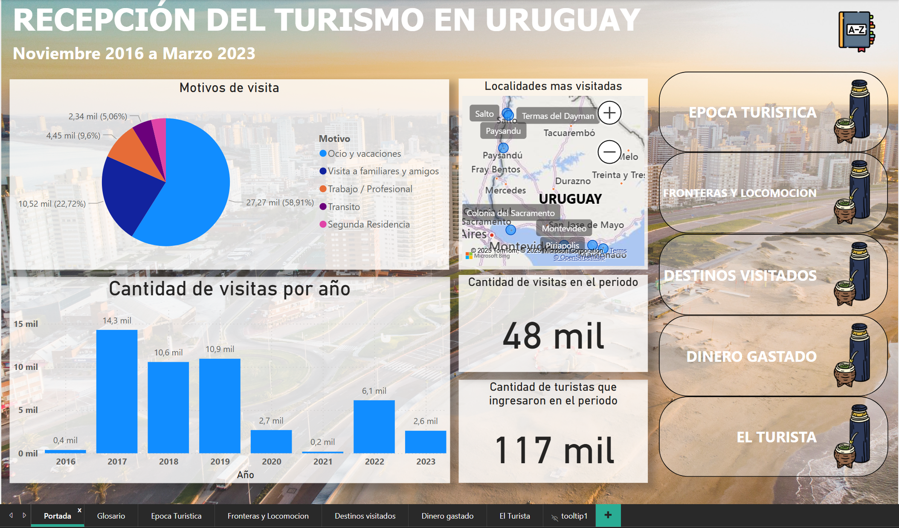
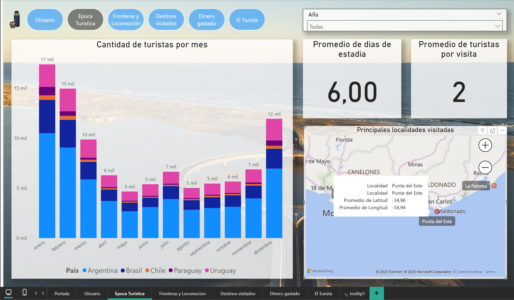
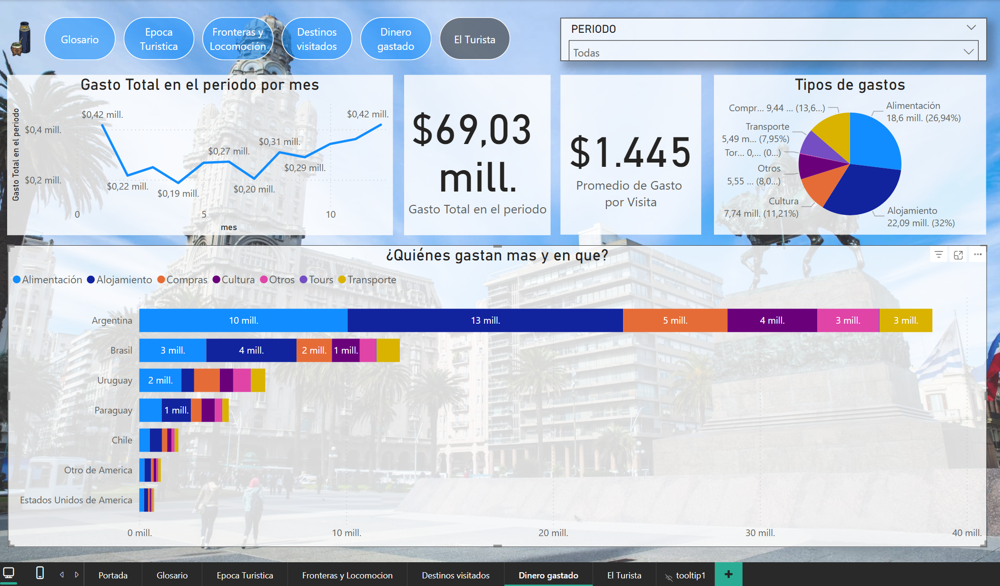

# Dashboard sobre Turismo en Uruguay – Proyecto Coderhouse (2023)

**Objetivo.**  
Desarrollar un dashboard interactivo en Power BI para analizar el impacto del Turismo en Uruguay en los periodos 2016-2023. El proyecto fue realizado como trabajo final del curso de Data Analytics en Coderhouse.

**Dataset.**  
Base de datos descargada desde el conjunto de datos del Estado Uruguayo. Contenía información de quienes ingresaban y salian del pais, sus nacionalidades, edades, ocupaciones, procedencias, a donde iban, sus gastos, entre otros.

**Herramientas.**  
- Power BI (modelado de datos, medidas DAX, visualizaciones)  
- Excel, SQL (limpieza y preparación de datos)  

**Principales hallazgos.**  
- Razón principal de visitas: Ocio y vacaiones
- Principal mes de turismo: Enero
- Localidad que mas ingresos genera: Punta del Este
- Promedio de gasto por visita: U$D 1445 

**Capturas.**  
  
  
  

**Archivos.**  
- `dashboard.pbix` (archivo de Power BI)  
- `inform.pdf` (explicación del análisis y conclusiones)

**Autor.**  
Enzo Thome — Data Analyst Jr.

